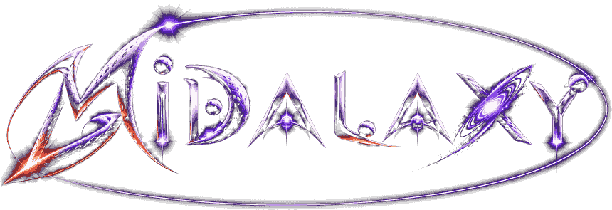
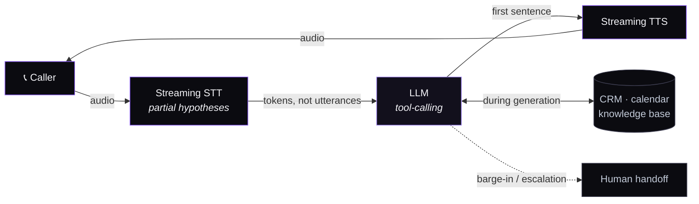

<!-- The mark is white-and-chrome on a dark field, so it would vanish on
     GitHub's light theme. <picture> swaps in a dark card there instead. -->
<picture>
  <source media="(prefers-color-scheme: dark)" srcset="./assets/logo-dark.png">
  <source media="(prefers-color-scheme: light)" srcset="./assets/logo-light.png">
  
</picture>

 

**AI that survives production**

Voice agents, RAG systems and clinical AI running under real load — 
not demos that break the week after launch.

 

Bangalore, India — delivering worldwide

 

---

## Systems in production

Every number below was measured by the business running the system.

<table>
<tr><th align="left">System</th><th align="left">Measured</th></tr>

<tr><td valign="top">

**Voice intelligence platform** 
Real-time STT→LLM→TTS with agentic decision loops, post-call automation and Kubernetes auto-scaling

</td><td valign="top">

`10,000+` concurrent calls 
`<500ms` end-to-end 
`99.9%` uptime · `45%` lower opex

</td></tr>

<tr><td valign="top">

**NHS-grade clinical AI** 
Deep-learning CT analysis with role-based clinical workflows and automated reporting for lung nodule risk

</td><td valign="top">

`>0.85` Dice coefficient 
`92%` classification accuracy 
`85%` faster reporting

</td></tr>

<tr><td valign="top">

**Discovery & ranking engine** 
Multi-phase ranking with GRU event encoding and natural-language search on a real-time vector store

</td><td valign="top">

`<50ms` retrieval 
`9` prediction heads 
`128-D` embedding search

</td></tr>

<tr><td valign="top">

**Multi-tenant restaurant SaaS** 
POS, kitchen displays, QR ordering, inventory, reservations and analytics with an embedded booking agent

</td><td valign="top">

`132` API endpoints 
`53` pages · `9` languages (RTL) 
`23` RBAC scopes

</td></tr>

<tr><td valign="top">

**Agentic video production** 
LLM-directed pipelines turning declarative manifests into finished video

</td><td valign="top">

`11` pipeline types 
`0-code` provider swapping

</td></tr>

<tr><td valign="top">

**SiteChat & Estimate256** 
Zero-code website chatbot platform plus a domain-tuned ML estimation engine

</td><td valign="top">

`Any URL` → chatbot 
`3` domain-tuned XGBoost models

</td></tr>
</table>

<a href="https://midalaxy.com/work"><b>Full case studies →</b></a>

---

## Where the 500ms goes

The latency budget is the whole problem in real-time voice. Above roughly 800ms callers start talking over the agent; below 500ms they simply talk. Every hop is streamed, and nothing waits for the hop before it to finish.

The hard part was never one call. It was holding that budget while auto-scaling to ten thousand of them.

---

## What we build

<table>
<tr>
<td width="50%" valign="top">

#### [AI Voice Agents](https://midalaxy.com/services/ai-voice-agents)
Phone and web agents that sound human and never sleep. Sub-500ms pipelines, multi-turn memory, CRM and calendar automation.

#### [RAG Chatbots](https://midalaxy.com/services/rag-chatbot-development)
Grounded in your own data, with retrieval you can evaluate and guardrails you can audit.

#### [AI Avatars & Digital Humans](https://midalaxy.com/services/ai-avatar-development)
Lifelike presenters that speak for your brand in real time.

#### [Healthcare AI](https://midalaxy.com/services/healthcare-ai-development)
Clinical-grade imaging, workflows and reporting that clinicians will actually trust.

</td>
<td width="50%" valign="top">

#### [Recommendation & Search](https://midalaxy.com/services/recommendation-engines)
Ranking tuned to conversions and verified outcomes, not clicks.

#### [AI-Powered SaaS](https://midalaxy.com/services/ai-saas-development)
Full-stack multi-tenant platforms with AI built in, shipped to production.

#### [Agentic Workflow Automation](https://midalaxy.com/services/ai-workflow-automation)
Tool-calling agents that remove the busywork between your systems.

#### [AI Video Production](https://midalaxy.com/services/ai-video-production)
Instruction-driven pipelines that turn scripts into finished video at scale.

</td>
</tr>
</table>

---

## How we work

| | |
| :--- | :--- |
| **Fixed milestones, weekly demos** | Working software at every checkpoint, not a big-bang delivery. |
| **The engineers who scope it, build it** | No handoff to juniors after the sales call. |
| **You own everything** | Code, models and documentation transfer to you. Built for handover, not lock-in. |
| **We scope to your budget** | No price list — cost depends entirely on scope. Tell us your budget and we'll say honestly what fits inside it. |
| **We'll talk you out of it** | If an off-the-shelf tool suits you better, we say so. |

---

## Engineering we care about

 

Open problems we're actively working on — latency budgets under load, retrieval measured against real support transcripts rather than benchmarks, and decision loops that survive production — are written up at **[midalaxy.com/labs](https://midalaxy.com/labs)**.

---

 

### Building something that has to work under load?

**[Start a conversation →](https://midalaxy.com/contact)**

 

Led by <a href="https://www.linkedin.com/in/mohammed-affaan-khan-048954174">Mohammed Affaan Khan</a> GenAI &amp; Agentic AI engineer · previously JP Morgan Chase

